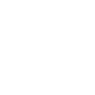

Hi, I need help finishing my Sawari landing page project in this workspace.

Goal:
Make the website match my attached reference image exactly.

---

## Source of Truth Priority (STRICT ORDER)

1. **FINAL DESIGN image** (attached screenshot) — primary source of truth for layout, spacing, typography, and visual design. Always wins.
2. **`design/` folder** — real assets from the designer. Contains the correct final icons, images, and graphics to use.
3. **`assets/psd-export/`** — PSD-exported assets. Use for numbered image files referenced in HTML.
4. **ZIP file (`sawari-deploy-webuzo.zip`)** — reference code only. ⚠️ SOME SECTIONS ARE CORRECT, SOME ARE WRONG. Do NOT blindly copy from the zip. Always get confirmation from the user before adopting any section from the zip.

**Rule**: Never apply changes from the zip to a section without explicit user confirmation that the zip version of that section is correct.

---

Project files:
index.html, styles.css, script.js, server.js, assets/psd-export, design/

---

## Section Build Status

| # | Section | Status |
|---|---|---|
| 1 | Header + Hero | ✅ Done |
| 2 | Project Overview | ✅ Done |
| 3 | Amenities | ✅ Done (icons pending designer) |
| 4 | Video CTA | ✅ Done — filter fixed using 196-bg-7.png overlay |
| 5 | Location | ✅ Done — typography, vertical bar, tabs, map overlap with beige strip, font swap to Jost |
| 6 | Floor Plans | ✅ Done — beige backgrounds restored, floor plan image opacity/filter applied |
| 7 | Numbers / Stats | ✅ Done — border lines removed, white space adjusted, numbers color set to Myrtle Green |
| 8 | Photo Gallery | ✅ Done — full-width beige bar, gallery head at 265px, filter tabs at 47rem, zoom icon 30px, label 100px |
| 9 | Virtual Tour | 🔲 Remaining |
| 10 | Philosophy (Animation) | 🔲 Remaining |
| 11 | FAQ | 🔲 Remaining |
| 12 | Newsletter | 🔲 Remaining |
| 13 | Register | 🔲 Remaining |
| 14 | Downloads | 🔲 Remaining |
| 15 | Footer | 🔲 Remaining |

---

## SESSION HANDOFF NOTES (March 26, 2026)

### ✅ Completed This Session
- Section 4 (Video CTA): teal overlay fixed — replaced solid color+opacity with `196-bg-7.png` PNG overlay asset
- Section 5 (Location): top padding-top increased from `2.125rem` → `5.5rem` to match reference spacing
- Section 6 (Floor Plans): Restored beige backgrounds (167-bg-6.png, 166-bg-5.png), applied opacity 0.5 + brightness filter to floor plan image
- Section 7 (Stats): Removed border lines, adjusted vertical spacing (margin-top: -1rem, min-height: 320px), numbers color: Myrtle Green (#264620)

### ⚠️ Section 5 — Awaiting User Test
- Spacing fix applied. User will test and return with feedback.
- Do NOT touch Section 5 further until user confirms or provides new instructions.

---

## SESSION HANDOFF NOTES (March 25, 2026)

### ✅ Completed (March 25)
- Git: Reverted last 2 premature commits (git reset --hard HEAD~2 + force push)
- Section 4 (Video CTA): Background image filter structure rebuilt using ::before / ::after layers
- Section 4: CTA text font set to Futura, size 33px (corrected from 36px), weight 500, uppercase, #ffffff

### ~~⚠️ STILL BROKEN — Section 4 Filter~~ ✅ FIXED
Fixed by replacing `.video-cta::after` solid color overlay with `url('assets/psd-export/196-bg-7.png')` PNG asset.

### Typography Reference — Full Site

All headings/titles use: `font-family: 'Futura', 'Futura PT', sans-serif`

| Element | Font | Size (px) | Notes |
|---|---|---|---|
| All section titles (e.g. "Location & Connectivity") | Futura | 48.75 | Used site-wide for major headings |
| Corp / company name / hero large text | Futura | 80 | Hero/brand display size |
| Section 4 Video CTA text ("EXPLORE THE FUTURE / OF SAWARI AJMAN") | Futura | 33 | Confirmed 33px, uppercase |
| Location subtitle ("Strategically positioned…") | Futura | 33 | Section subtitle text |
| Stat numbers (75, 151, 275, 316) | Futura | 60 | Large stat figures |
| Stat labels ("Completed Projects", "Finished Projects", etc.) | Futura | 18 | Below stat numbers |
| Distance labels ("10 Mins Sharjah…", "13 Mins Al Zorah…") | Futura | 21.71 | Location connectivity strip |

**Summary of confirmed sizes**: 80 / 48.75 / 33 / 21.71 / 60 / 18

### Typography Reference (Section 4 — Video CTA)
- Font: `'Futura', 'Futura PT', sans-serif`
- Size: `33px` ← **corrected from earlier session (was wrongly set to 36px)**
- Weight: `500` (regular words) / `700` (strong tags)
- Case: `uppercase`
- Color: `#ffffff`
- Letter-spacing: `0.04em`

### CSS Variable
- `--deep: #4f6662` (the teal color used for the overlay)

### Brand Color Palette

| Name | Hex | CSS Variable |
|---|---|---|
| Pearl White | `#f2f2f4` | `--pearl-white` |
| Marble White | `#f3eee7` | `--marble-white` |
| Limestone Grey | `#e5e2da` | `--limestone` |
| Quill Grey | `#c6cfbf` | `--quill-grey` |
| Natural Beige | `#a3937b` |`--natural-beige` |
| Teakwood Beige | `#8d7f6a` | `--teakwood` |
| Palm Green | `#69713e` | `--palm-green` |
| Myrtle Green | `#264620` | `--myrtle` |
| Midnight Black | `#151207` | `--midnight` |
| Solid Black | `#000000` | `--black` |

### Section 4 HTML structure
```html
<section class="video-cta section-dark">
  <div class="container cta-inner reveal">
    <span class="cta-text-left">EXPLORE THE <strong>FUTURE</strong></span>
    <button class="play" type="button" aria-label="Play video">
      
    </button>
    <span class="cta-text-right">OF <strong>SAWARI AJMAN</strong></span>
  </div>
</section>
```

---

## Remaining Tasks

1. Fix the Project Overview section image composition and spacing to match the reference.
2. Replace any placeholders or wrong images with original PSD-exported assets where available.
3. Finish the bottom area parity:
   - Contact strip
   - Register Your Interest form block
   - Documents strip with correct PDF icons/text alignment
4. Keep existing working interactions unless they conflict with the reference.

## Output format
Short plan → Applied file changes → Visual parity notes → Next small step

## Important
Keep responses concise. Avoid large repeated summaries to prevent request-size errors.
Edit styles.css directly using exact string replacements (Node.js if needed due to Unicode characters in comments).
Never use regex scripts that touch multiple selectors at once — they cause cascading syntax corruption.